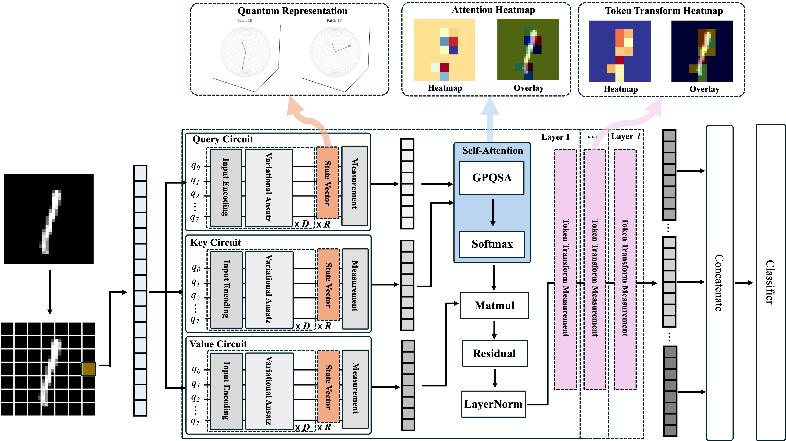

# Development and Validation of Interpretable Quantum Self-Attention Neural Networks for Image Classification

## Overview

This repository contains the implementation of Quantum Self-Attention Neural Network (QSANN) for image classification tasks.

## Model Architecture



## Environment Setup

Create and activate the conda environment using the provided environment file:

```bash
conda env create -f environment.yml
conda activate qsann
```

## Experiment Reproduction

### Multi-Class Classification Tasks

#### 1. Small MNIST (8×8)
```bash
python main.py \
  --dataset-choice mnist \
  --classification-task multi \
  --train-count 320 \
  --val-count 0 \
  --test-count 80 \
  --image-size 8 \
  --patch-size 4 \
  --num-qubits 8 \
  --vqc-layers 4 \
  --reuploading 2 \
  --attn-layers 1 \
  --epochs 30 \
  --batch-size 16 \
  --learning-rate 0.01 \
  --seed 42
```

#### 2. MNIST (28×28)
```bash
python main.py \
  --dataset-choice mnist \
  --classification-task multi \
  --train-count 320 \
  --val-count 0 \
  --test-count 80 \
  --image-size 28 \
  --patch-size 4 \
  --num-qubits 8 \
  --vqc-layers 4 \
  --reuploading 2 \
  --attn-layers 1 \
  --epochs 30 \
  --batch-size 16 \
  --learning-rate 0.01 \
  --seed 42
```

#### 3. Fashion-MNIST
```bash
python main.py \
  --dataset-choice fmnist \
  --classification-task multi \
  --train-count 320 \
  --val-count 0 \
  --test-count 80 \
  --image-size 28 \
  --patch-size 4 \
  --num-qubits 8 \
  --vqc-layers 4 \
  --reuploading 2 \
  --attn-layers 1 \
  --epochs 30 \
  --batch-size 16 \
  --learning-rate 0.01 \
  --seed 42
```

#### 4. CIFAR-10
```bash
python main.py \
  --dataset-choice cifar10 \
  --classification-task multi \
  --train-count 320 \
  --val-count 0 \
  --test-count 80 \
  --image-size 32 \
  --patch-size 4 \
  --num-qubits 8 \
  --vqc-layers 4 \
  --reuploading 2 \
  --attn-layers 1 \
  --epochs 30 \
  --batch-size 16 \
  --learning-rate 0.01 \
  --seed 42
```

### Binary Classification Tasks

#### 1. MNIST
```bash
python main.py \
  --dataset-choice mnist \
  --classification-task binary \
  --train-count 1000 \
  --val-count 100 \
  --test-count 100 \
  --image-size 28 \
  --patch-size 4 \
  --num-qubits 8 \
  --vqc-layers 1 \
  --reuploading 3 \
  --attn-layers 1 \
  --epochs 300 \
  --batch-size 32 \
  --learning-rate 0.05 \
  --seed 42 \
  --early-stop \
  --early-stop-patience 10
```

#### 2. Fashion-MNIST
```bash
python main.py \
  --dataset-choice fmnist \
  --classification-task binary \
  --train-count 1000 \
  --val-count 100 \
  --test-count 100 \
  --image-size 28 \
  --patch-size 4 \
  --num-qubits 8 \
  --vqc-layers 3 \
  --reuploading 3 \
  --attn-layers 1 \
  --epochs 300 \
  --batch-size 32 \
  --learning-rate 0.05 \
  --seed 42 \
  --early-stop \
  --early-stop-patience 10
```

#### 3. CIFAR-10
```bash
python main.py \
  --dataset-choice cifar10 \
  --classification-task binary \
  --train-count 1000 \
  --val-count 100 \
  --test-count 100 \
  --image-size 28 \
  --patch-size 4 \
  --num-qubits 8 \
  --vqc-layers 3 \
  --reuploading 3 \
  --attn-layers 1 \
  --epochs 300 \
  --batch-size 32 \
  --learning-rate 0.05 \
  --seed 42 \
  --early-stop \
  --early-stop-patience 10
```

#### 4. PCam
```bash
python main.py \
  --dataset-choice pcam \
  --classification-task binary \
  --train-count 1000 \
  --val-count 100 \
  --test-count 100 \
  --image-size 28 \
  --patch-size 4 \
  --num-qubits 8 \
  --vqc-layers 4 \
  --reuploading 1 \
  --attn-layers 1 \
  --epochs 300 \
  --batch-size 16 \
  --learning-rate 0.05 \
  --seed 42 \
  --early-stop \
  --early-stop-patience 10
```

## Output
- Training logs: `results/logs/` directory
- Model checkpoints: `results/models/` directory
- Outputs Train/Val/Test accuracy, AUROC, Precision, Recall, F1-score per epoch
